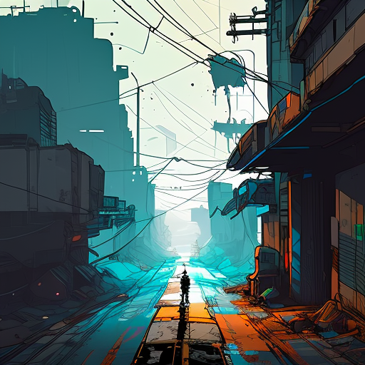
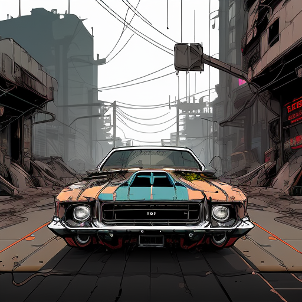

## Latent Diffusion Model - Stable Diffusion v1.5 Implementation

With a focus on learning the internals of the Image generation model, I implemented a stable diffusion pipeline. The goal of this project is to explore and implement the main components of the Stable Diffusion v1.5 image generation model, that is, the Variational auto-encoder, CLIP, Unet, DDPM sampler, and diffusion pipeline excluding the CLIP tokenizer for simplicity.

The code is based on the teachings from the [hkproj](https://github.com/hkproj) video on Stable Diffusion and did require to go through his implementation and CompVis implementation. \
Supports: standard model like v1-5-pruned-emaonly.ckpt and fine-tuned models like inkpunk-diffusion-v1.ckpt

## Model Architecture
This project uses a latent diffusion model, where:

Images are encoded into latent space using a variational autoencoder (VAE).
Diffusion is performed in the latent space, making it computationally efficient.
Noise is progressively added and denoised in several timesteps.
Important Note: In this simplified version, the CLIP tokenizer is not used, so the model expects simplified input prompts or manual embeddings for text-to-image generation.

## How It Works
Latent Space Representation:

The image is encoded into a lower-dimensional latent space using a pre-trained VAE.
Noise Schedule:

A beta schedule is defined (between beta_start and beta_end), which determines how noise is added at each timestep.
Denoising Process:

At each timestep, the latent representation of the image is progressively denoised using a U-Net architecture.
The model learns to predict the noise added at each timestep.
Image Decoding:

After denoising, the latent representation is decoded back into pixel space to generate the final image.

## Acknowledgement
1. hkproj video lessons: Video lessons on latent diffusion models. \
https://github.com/hkproj/pytorch-stable-diffusion \
youtube: https://www.youtube.com/@umarjamilai

2. Stable Diffusion: Official GitHub repository for Stable Diffusion. \
https://github.com/CompVis/stable-diffusion/

## Paper References
1. Rombach et al., High-Resolution Image Synthesis with Latent Diffusion Models. 2022\
Presented the main idea of using a small latent space to represent an image and apply a diffusion process on that.\
https://doi.org/10.48550/arXiv.2112.10752
2. Ho et al., Denoising diffusion probabilistic models. NeurIPS 2020 \
The paper introduced the DDPM sampling technique for probabilistic diffusion models.\
https://doi.org/10.48550/arXiv.2006.11239

3. Vaswani et al., Attention is all you need. NeurIPS 2017. \
Multihead attention, scaled dot product attention, and positional embedding are based on this paper's which introduced transformer. \
https://doi.org/10.48550/arXiv.2112.10752
